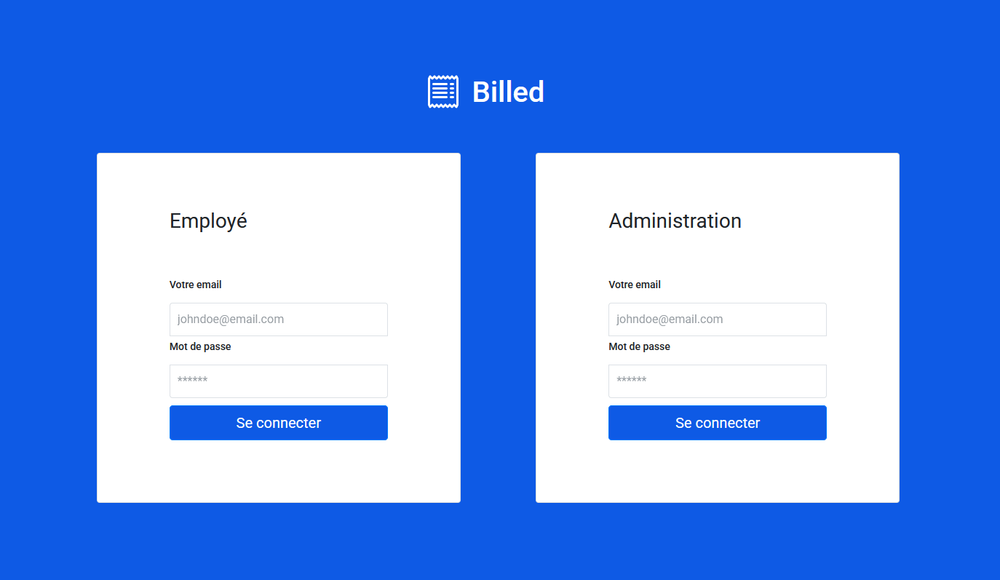

# Projet 9 : Billed (Débuggez et testez un SaaS RH)

9ème projet de la formation "Développeur d'application JavaScript React" d'OpenClassrooms.

## Contexte du projet

> Ce projet vous confie la tâche de débugger et tester une application. Vous travaillerez sur des tests unitaires et d'intégration en JavaScript et effectuerez des tests end-to-end manuels.
>
> Votre mission principale sera de corriger les bugs d’un système RH et de finaliser les tests. Vous commencerez par **installer le back-end** et le front-end depuis des repos spécifiques.
>
> Vous serez ensuite chargé de **déboguer certaines parties de l’application**.
>
> Vous rédigerez et implémenterez des **tests unitaires en JavaScript** pour vérifier la validité et la fiabilité des différentes composantes de l'application.
>
> Vous élaborerez également un **plan de test end-to-end manuel** pour assurer le bon fonctionnement du parcours employé de l'application.
>
> Le **Chrome Debugger** sera utilisé pour le débogage de l'application, vous permettant de détecter et de résoudre les problèmes de manière efficace.
>
> En plus des tests unitaires, vous écrirez des **tests d'intégration en JavaScript** pour vérifier l'interaction entre les différentes parties de l'application.

## Installation :

### Procédure d'installation :

Cloner le repository:

- `git clone https://github.com/nrundstadler/OCR-P9-Billed.git`

Pour installer et lancer le back-end, veuillez consulter les instructions détaillées dans le fichier [Installation et lancement du back-end](Billed-app-FR-Back/README.md).

Pour installer et lancer le front-end, veuillez consulter les instructions détaillées dans le fichier [Installation et lancement du front-end](Billed-app-FR-Front/README.md).
